# Home Lab Case Study: Segmented Network Foundation

*Portfolio copy — narrative summary with supporting evidence, suitable to show an employer or include in a GitHub repo/application. For the full technical build log (interface tables, exact IPs, rule-by-rule change history), see the working copy.*

---

## Overview

I built a fully virtualized network lab — no physical routers, switches, or access points — using VMware Workstation and pfSense CE, to practice the routing, segmentation, and firewall troubleshooting skills that underlie the largest single category of help desk tickets: connectivity issues. The lab simulates a small organization with two isolated network segments (Staff and Guest) behind a single firewall, plus a dedicated management path that stays reachable no matter what gets misconfigured elsewhere.

## Objective

Reproduce, entirely in software, the network foundation a help desk or desktop support role depends on day to day: routed, segmented subnets with their own DHCP scopes, firewall-enforced isolation between them, and the diagnostic muscle memory for the DHCP, DNS, and access issues that generate real tickets.

## Architecture

The firewall (pfSense CE) runs four virtual network interfaces: a WAN uplink to the internet, a LAN interface reserved exclusively for management access to the firewall's own configuration, and two additional interfaces — Staff (10.10.10.0/24) and Guest (10.10.20.0/24) — each on its own isolated virtual network with its own subnet and DHCP scope.

The LAN-as-management design was a deliberate choice, not the default. An earlier version of the plan repurposed the LAN interface itself as one of the two segments being tested. I changed that after recognizing a real operational risk: pfSense automatically protects only the interface named LAN with a built-in rule guaranteeing web GUI access, so reconfiguring firewall rules and IP addressing on that same interface risked locking myself out mid-change. Separating "the network I'm actively experimenting on" from "the path I use to fix it if I break it" is a pattern used in real production environments for exactly this reason, and applying it here turned a convenience into a design decision worth explaining in an interview.

**Basic routing, verified before firewall policy was layered on top:** once both OPT interfaces were addressed, I confirmed pfSense was routing between the two new segments at the IP layer before adding any firewall rules — a Staff-side client reaching Guest's gateway address directly:

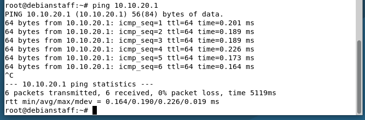

*Staff client reaching the Guest interface's gateway address (10.10.20.1), confirming pfSense was routing between the two new segments before any firewall policy was applied.*

**DHCP scopes**, one per segment plus the untouched LAN range, each issuing leases independently:

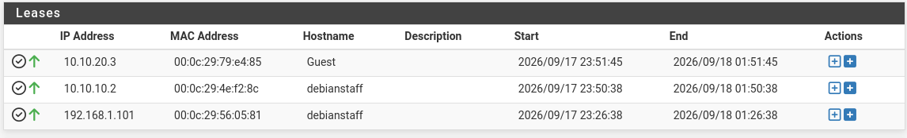

*Active leases across all three segments — Guest, Staff, and the LAN management network — confirming each interface's DHCP server is scoped correctly and issuing to the expected clients.*

Each test client also demonstrates holding two addresses at once on the same interface — a static assignment used for early connectivity testing, and a DHCP-issued secondary address picked up once the interface's DHCP server was verified:

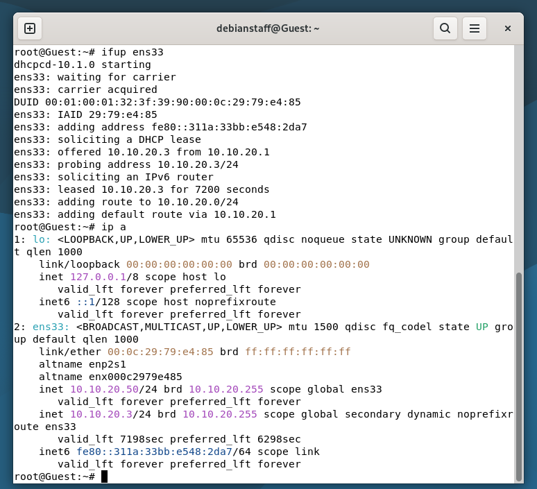

*Guest client bringing up its interface, negotiating a DHCP lease (10.10.20.3), and retaining its earlier static address (10.10.20.50) as a secondary — both live on the same NIC.*

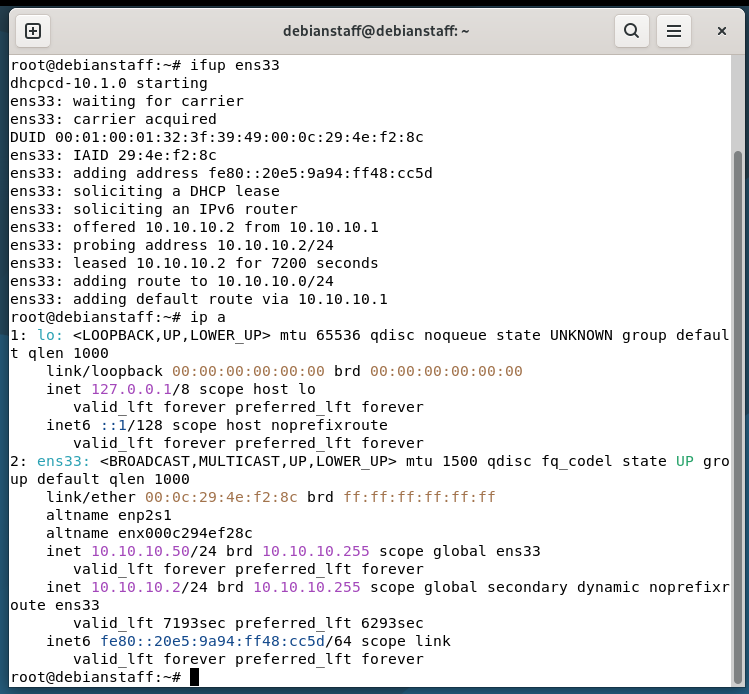

*Same pattern on the Staff client: DHCP-leased 10.10.10.2 alongside a static secondary address, confirming the DHCP scope and static addressing coexist without conflict.*

## Troubleshooting Highlight 1: Interfaces Start With Zero Rules (Step 4 — Segmentation Policy)

Step 4 of the build is where segmentation itself gets defined: static addressing on each new interface (Staff and Guest), a DHCP scope per segment, and a firewall policy that keeps the two segments from reaching each other by default. After building the two segments, Staff and Guest could obtain DHCP leases but had no route to the internet. Investigation showed that pfSense's automatic "allow this network out" rule only applies to the interface literally named LAN — newly created interfaces start with zero rules, meaning no traffic passes in or out by default. Rather than solving this with a single broad "allow everything" rule (which would have silently undone the segmentation between Staff and Guest), I implemented an ordered pair of rules per interface: an explicit block of traffic destined for the other segment, followed by a general allow rule for everything else. This block rule *is* the segmentation policy — it's the proof that Staff and Guest are actually isolated from each other, not just routed through the same firewall.

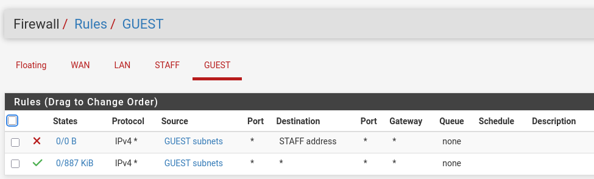

*Guest interface after the fix: a block rule targeting the Staff segment, followed by a general allow rule restoring internet access.*

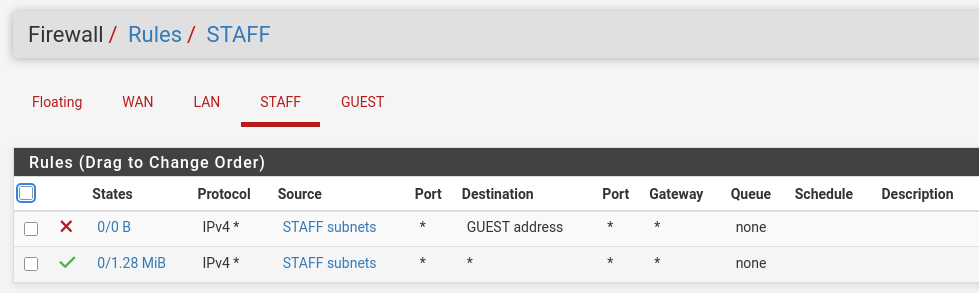

*The mirrored rule pair on the Staff interface.*

This restored internet access for both segments while preserving — and making explicit and auditable — the isolation between them.

There's a subtlety in these two rule sets worth calling out, because it's the same one that resurfaces below: each block rule's destination is scoped using pfSense's **"address"** object type, not **"subnets."** In pfSense, "address" matches only one specific IP — in this case, the firewall's own interface IP on the opposite segment — while "subnets" matches the entire network range behind that interface. The two options sit right next to each other in the same dropdown and look almost identical at a glance, but they produce very different firewalls: one blocks a single address that real client traffic rarely touches directly, the other blocks the whole segment. At this point in the build, the rules *looked* like a working segmentation policy — internet access came back, the GUI showed a clean block-then-allow pair — but the block itself wasn't actually scoped to stop ordinary Staff-to-Guest or Guest-to-Staff traffic yet. That gap didn't surface until the segmentation test in Step 7, covered next.

## Troubleshooting Highlight 2: A Narrow Exception, and a Hidden Rule-Scope Bug

Later, I needed one specific Staff host to reach one specific Guest host without giving up segmentation for every other device on either network — a realistic scenario (e.g., a help desk workstation needing access to a specific guest-network kiosk for support purposes). The correct approach is a narrow exception, not a blanket change: I added a host-to-host allow rule, scoped to those two exact addresses, placed *above* the existing block rule rather than editing the block rule itself.

*Confirming the Staff test host's address (10.10.10.150) via its active DHCP lease before troubleshooting further.*

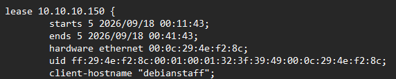

*Cross-checking the same lease directly in the DHCP server's lease file, tying the hostname to the address being used in the exception rule.*

Despite the new rule appearing correctly scoped and correctly ordered, the initial re-test still failed in both directions:

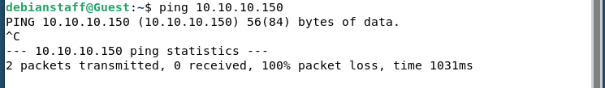

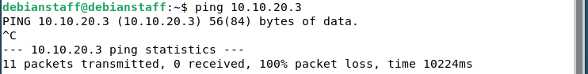

These two failed tests are worth pausing on, because they're doing double duty: on their own, a Staff host and a Guest host failing to reach each other is exactly the proof-of-segmentation this lab set out to produce back in Step 4 — the deny policy was, in fact, stopping ordinary cross-segment traffic. The problem was narrower than "segmentation isn't working" — it was that *this specific exception* wasn't taking effect on top of it.

Rather than guessing further, I used each rule's built-in state/byte counters — a running total of traffic that has actually matched that rule — to see what was really happening. The new exception rule showed zero traffic matched, meaning the problem was upstream of the rule's own logic. Reviewing the general block rule directly above it turned up the real issue: its destination field was scoped to the object type **"address"** (which matches only pfSense's own interface IP) rather than **"subnets"** (which matches actual client traffic) — the same "address" vs. "subnets" distinction flagged back in Step 4. In other words, the misconfiguration wasn't new — it had been sitting in the ruleset since Step 4, just never exercised by a test specific enough to expose it. Ordinary Staff and Guest hosts happened to fail their reachability tests for the right reason (segmentation-by-default plus the exception not yet matching), which is why the bug went unnoticed until this point.

After correcting both interfaces' block rules to the proper subnet scope, the ruleset was re-verified:

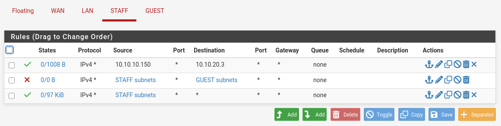

*Staff interface, Step 4's segmentation policy now corrected and extended: row 1 is the new host-specific exception rule (evaluated first, so it takes effect before the segmentation rule below it ever gets a chance to block this one pair); row 2 is Step 4's original deny rule, now properly scoped to "subnets" instead of "address"; row 3 is Step 4's original general allow rule that restores everyday internet access.*

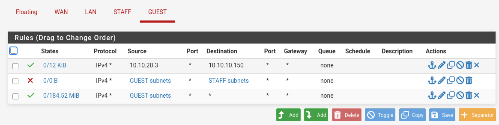

*The mirrored, corrected ruleset on the Guest interface — same three-rule structure, same fix applied.*

With the fix applied, the test passed cleanly in both directions:

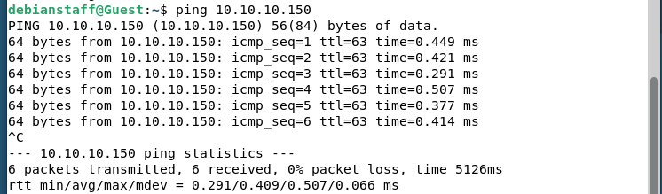

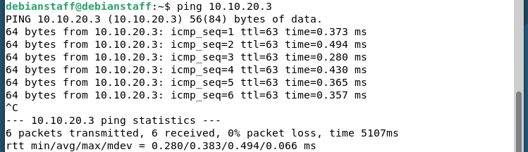

The per-rule traffic counters confirmed this wasn't a coincidence: the specific exception rule showed non-zero traffic matching exactly this host pair, while the general block rule remained untouched at zero — proof that segmentation was intact for every other host, and the exception applied only where intended.

## Skills Demonstrated

Virtual network segmentation design and implementation (VLAN-equivalent, fully software-defined); firewall rule authoring, ordering, and troubleshooting, including diagnosing a subtle object-scope misconfiguration ("address" vs. "subnets") using per-rule traffic counters rather than guesswork; DHCP scope configuration and multi-address interface verification; and structured technical documentation — as-built reference, change log, and incident records maintained throughout the build rather than reconstructed after the fact.
